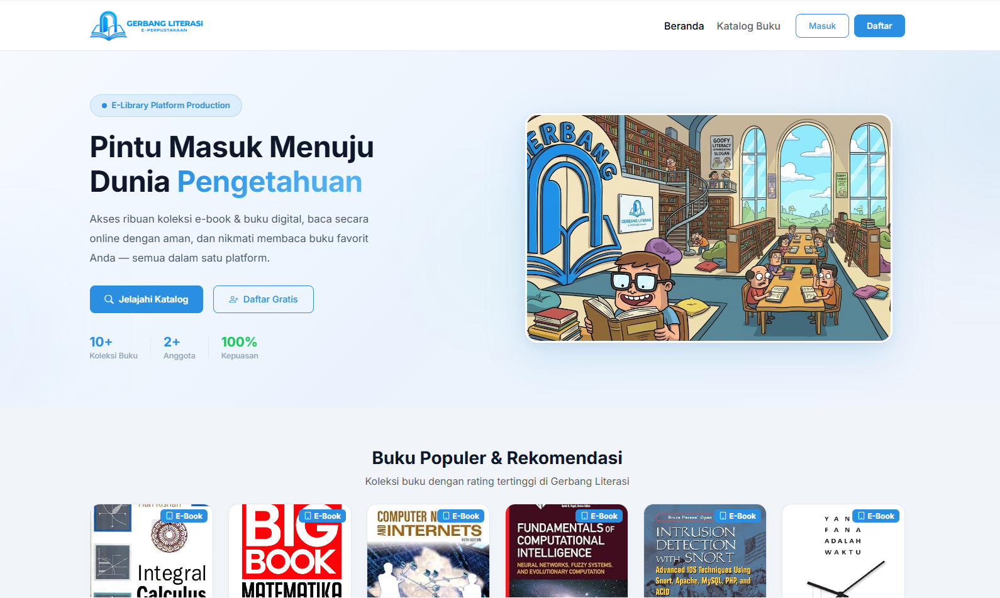
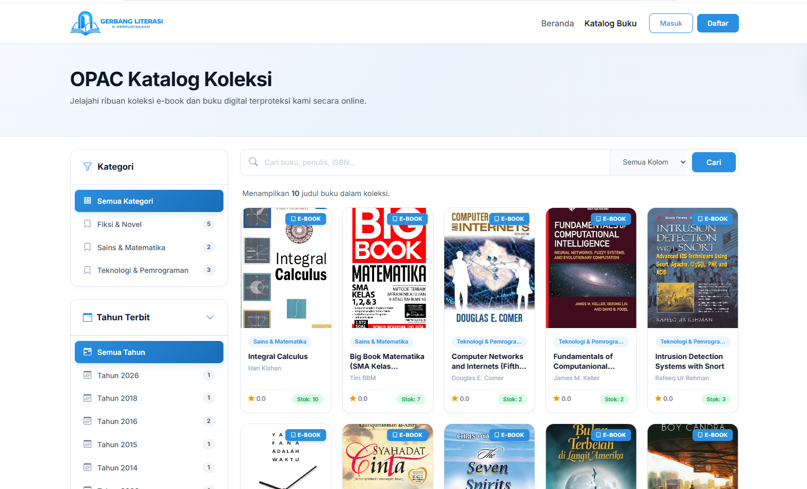
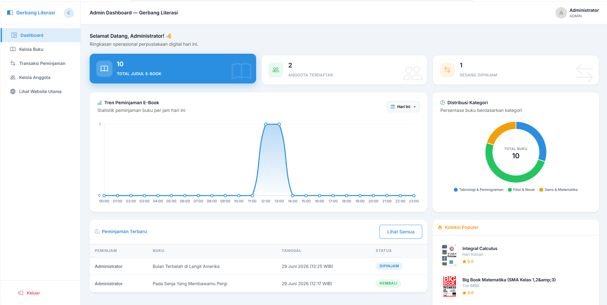

# Gerbang Literasi — E-Library & Digital DRM System


---

### 👨‍🎓 Identitas Pengembang
* **Nama**: Muhamad Faridzqi Suryadi
* **NIM**: 24260045
* **Program Studi**: Teknik Informatika

---

Platform e-library modern berbasis web dengan sistem DRM, antrean lisensi otomatis, dan pembaca e-book langsung di browser. Dikembangkan menggunakan **PHP Native** dengan arsitektur yang terstruktur dan antarmuka premium.

---

## 📸 Preview Tampilan

Klik pada gambar untuk memperbesar (zoom) tampilan.

| [](assets/img/ss/landing_page.png) | [](assets/img/ss/katalog_book.png) | [](assets/img/ss/admin_dashboard.png) |
| :---: | :---: | :---: |
| **Landing Page** | **Katalog Book** | **Admin Dashboard** |

---

## 🚀 Fitur Utama

### 1. Antarmuka Responsif dan Interaktif
* **Menu Navigasi Responsif**: Menggunakan panel navigasi berbentuk drawer dengan animasi geser yang halus.
* **Animasi Elemen Bertahap**: Item menu dan tombol aksi ditampilkan secara berurutan untuk memberikan transisi yang lebih nyaman.
* **Header Dinamis**: Tampilan header menyesuaikan secara otomatis berdasarkan posisi scroll pengguna.
* **Dropdown Ramah Mobile**: Tata letak menu dropdown disesuaikan agar tetap terlihat dengan baik pada berbagai ukuran layar..

### 2. Manajemen Lisensi Digital dan Pengembalian Otomatis
* **Kontrol Lisensi**: E-book hanya dapat diakses oleh pengguna yang memiliki status peminjaman aktif.
* **Pengembalian Otomatis**: Sistem mengakhiri masa peminjaman dan mengembalikan lisensi secara otomatis setelah batas waktu berakhir.
* **Sistem Antrean**: Ketika seluruh lisensi sedang digunakan, pengguna dapat bergabung dalam daftar antrean. Lisensi akan diberikan secara otomatis kepada pengguna berikutnya setelah tersedia.


### 3. Pembaca E-Book PDF

* **Dua Mode Membaca**: Pengguna dapat memilih tampilan gulir vertikal atau navigasi per halaman.
* **Navigasi Interaktif**: Perpindahan halaman mendukung gestur geser pada perangkat mobile serta drag menggunakan mouse pada desktop.
* **Pemuatan Halaman Efisien**: Sistem hanya memuat halaman yang sedang dibaca dan halaman di sekitarnya untuk menjaga performa.
* **Perlindungan Dokumen**: Akses file dibatasi dengan menonaktifkan klik kanan, pencetakan, penyimpanan, dan beberapa pintasan keyboard tertentu.

---

## 🛠️ Stack Teknologi

* **Backend**: PHP Native (version >= 7.4)
* **Database**: MySQL / MariaDB (PDO Engine)
* **Frontend / Styling**: Vanilla CSS & Bootstrap 5 (CSS-driven Transitions & Layouts)
* **Icons**: Bootstrap Icons (CDN)
* **Library PDF**: PDF.js (v3.11.174 via Cloudflare CDN)

---

## 📂 Struktur Project

```text
e-library/
├── actions/             # File aksi pemrosesan data (login, pinjam, dll)
├── admin/               # Panel admin untuk kelola buku, anggota & lisensi
├── assets/              # Asset statis (CSS, Javascript, Gambar, SVG)
│   ├── css/
│   │   └── style.css    # Custom styling e-library
│   └── img/             # Logo & sampul buku
├── config/              # Konfigurasi database & security
├── helpers/             # Helper fungsi (format tanggal, auth, borrow)
├── includes/            # Layout re-usable (header, footer, navbar, sidebar)
├── storage/             # Tempat penyimpanan file privat
│   ├── avatars/         # Foto profil pengguna
│   └── ebooks/          # File e-book PDF terproteksi
├── user/                # Halaman dashboard & settings anggota
├── elibrary_db.sql      # Skema & data lengkap database ter-export
├── index.php            # Halaman landing page / katalog publik
└── README.md            # Dokumentasi proyek
```

---

## ⚙️ Langkah Instalasi & Menjalankan Project

### Prasyarat
* **Web Server**: Apache (Laragon / XAMPP / MAMP)
* **PHP**: Versi 7.4 ke atas
* **Database**: MySQL / MariaDB

### Langkah Instalasi

1. **Salin Project**
   Letakkan folder project ke dalam direktori server lokal, seperti:

   ```text
   C:\laragon\www\e-library
   ```

   atau:

   ```text
   C:\xampp\htdocs\e-library
   ```

2. **Siapkan Database**
   Jalankan layanan MySQL, kemudian impor file `elibrary_db.sql` melalui phpMyAdmin, Adminer, atau MySQL CLI.

   Database tidak perlu dibuat secara manual karena file SQL sudah dilengkapi perintah untuk membuat dan memilih database `elibrary_db`.

3. **Atur Konfigurasi**
   Sesuaikan pengaturan berikut:

   * Buka `config/database.php`, kemudian atur `host`, `db_name`, `username`, dan `password`.
   * Buka `config/config.php`, kemudian sesuaikan nilai `BASE_URL`.

   Contoh:

   ```php
   define('BASE_URL', 'http://localhost/e-library/');
   ```

4. **Jalankan Aplikasi**
   Buka browser dan akses:

   ```text
   http://localhost/e-library/
   ```


---

## 🔐 Kredensial Default Pengujian

Gunakan akun di bawah ini untuk menguji fitur dengan peran (role) yang berbeda:

| Peran (Role) | Email | Password | Hak Akses |
| :--- | :--- | :--- | :--- |
| **Administrator** | `admin@gerbangliterasi.id` | `admin123` | Manajemen buku, kelola lisensi & anggota |
| **Anggota Demo** | `user@gerbangliterasi.id` | `user123` | Meminjam buku, antre lisensi & membaca e-book |

---


